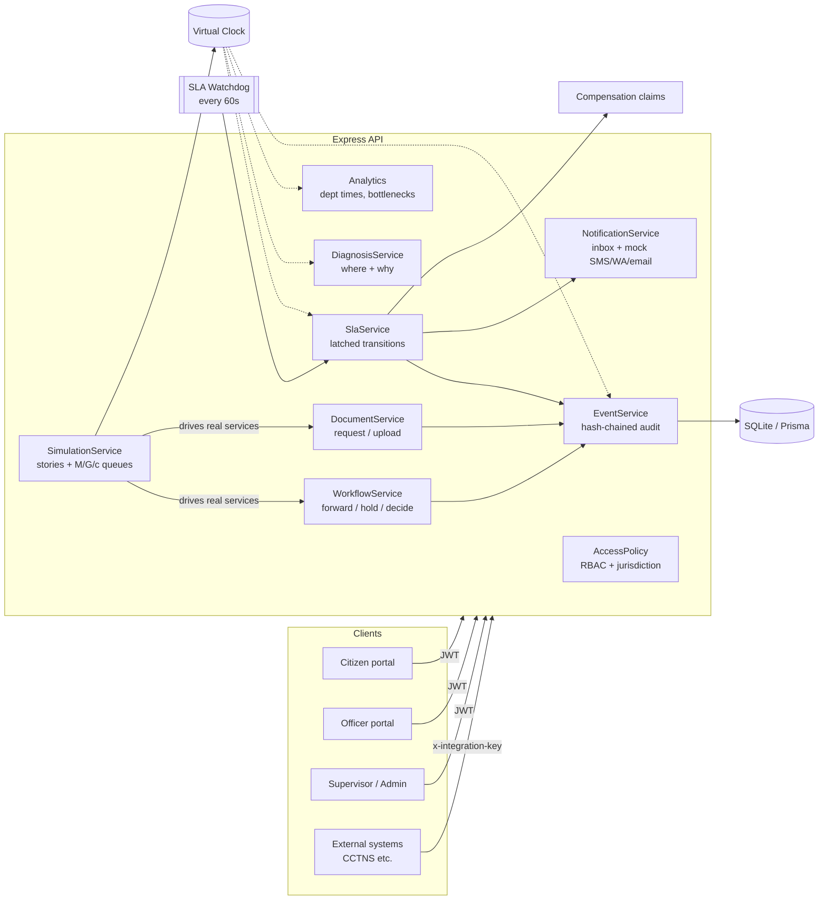

# DocTrail Backend v2

**Track one citizen application across departments, and show where it is stuck and why.**

Express + TypeScript + Prisma (SQLite) modular monolith. Version 2 adds:

- a virtual clock and a simulation engine;
- a deterministic "where/why stuck" diagnosis;
- latched SLA breaches with escalation;
- plain-language SMS/WhatsApp/email notification mocks;
- utilisation-based bottleneck analytics;
- a full role-based-access and privacy pass.



## Run it

```bash
cd backend
npm install
cp .env.example .env                 # set JWT_SECRET for anything beyond local dev
npx prisma db push                   # applies the v2 schema (adds columns/tables)
npm run prisma:seed:samples          # seed users + ~10 days of realistic sample applications
npm run dev                          # http://localhost:4000
npm test                             # uses its own prisma/test.db, recreated each run
npm run demo                         # (server running) plays the "stuck at Police" story in the terminal
```

Seed logins (password `Password123!`):

| Role | Accounts |
|---|---|
| Citizen | `citizen@example.com` |
| Officers | `dm.officer@`, `police.officer@`, `sp.officer@`, `passport.officer@`, `municipal.officer@`, `health.officer@example.com` |
| Supervisor | `supervisor@example.com` |
| Admin | `admin@example.com` |

> Upgrading an existing `dev.db`: `npx prisma db push` adds the new nullable columns without data loss. Events written before v2 show up as `legacyUnsealedEvents` in the audit verifier. Run `POST /api/demo/reset` for a clean chain.

## Core concepts

### One ID, one timeline
Tracking numbers are `<PREFIX>-<YEAR>-<6-digit sequence>`, for example `GL-2026-000042`. They come from an atomic counter, so they never collide. Every state change appends a `StageEvent` with:
- a per-application `seq` number;
- a SHA-256 seal that covers the whole payload.

`GET /api/applications/:id/verify-audit-chain` recomputes every hash, so an edited or deleted row is detected.

### Virtual clock
All business logic reads `Clock.now()`. Normally the offset is 0. The simulator moves the clock forward, so SLA deadlines, reminders, breaches and bottlenecks happen for real, with consistent timestamps. Every response carries an `X-Server-Now` header. `GET /api/sim/clock` returns the current virtual time. Frontends should use either one for countdowns.

### SLA per stage, latched
`SlaService.refreshApplicationSla` is the single place where SLA transitions cause side effects.
- The first time a stage goes **AT_RISK** (the last 20% of its target): the system writes `atRiskAt`, records `SLA_WARNING`, and sends "running late" to the citizen and a queue alert to the department.
- The first time it **BREACHES**: the system writes `breachedAt`, records `SLA_BREACHED` and `ESCALATED`, sends "delayed" to the citizen and an escalation to supervisors, and creates a compensation claim pending approval.

Pausing and resuming can never emit these twice. Breach history survives after the file moves on, so analytics count historical breaches.

### Hold types
The clock pauses for one of four hold types:

| Hold type | Created by | Released by |
|---|---|---|
| `CITIZEN_DOCS` | document request | upload of the last pending document (automatic) |
| `CORRECTION` | decision `RETURNED_FOR_CORRECTION` | citizen `POST /:id/resubmit` |
| `ADMIN_HOLD` | officer hold | officer resume |
| `EXTERNAL` | officer hold with `holdType` | officer resume |

A document upload does not lift an administrative hold or a correction.

### Where is it stuck, and why (`DiagnosisService`)
Every active file gets exactly one reason code. It is derived from facts the system already holds: hold type, pending requests, assignment, idle time, SLA position, and the department's live queue position and throughput.

| Reason | Responsible party | Meaning |
|---|---|---|
| `WAITING_ON_CITIZEN` | Citizen | A requested document has not been uploaded. Reminders go out every 48h. |
| `RETURNED_FOR_CORRECTION` | Citizen | The citizen must fix the application and resubmit. |
| `ADMIN_HOLD` / `EXTERNAL_DEPENDENCY` | Department / External | Deliberately paused. |
| `DEPARTMENT_BACKLOG` | Department | At least 3 files are ahead in the queue and they will not clear before the target. |
| `UNASSIGNED` | Department | No officer has picked the file up. |
| `OFFICER_IDLE` | Officer | Assigned, but no activity for longer than the idle threshold. |
| `SLOW_PROCESSING` | Officer | Being worked on, but past or near the target. |
| `ON_TRACK` / `IN_REVIEW` | None | Normal. |

Each diagnosis carries:
- a severity;
- the location (stage, department, since when);
- timing (active, paused, remaining, overdue, idle);
- queue position;
- the pipeline;
- a **citizen sentence**;
- for staff only, an officer sentence and a recommended action.

### Bottleneck score (0–100, per stage)
- `35 × age`: the average active age of waiting files divided by the stage target.
- `30 × breaches`: the share of files that ever breached this stage.
- `20 × inflow`: arrivals minus completions over the last 7 days, divided by arrivals.
- `15 × backlog`: the number of waiting files, divided by 10.

The response includes the `dominantFactor` and a one-line `explanation`, so the dashboard can say why a stage is a bottleneck. A score of 40 or more is flagged as a bottleneck.

## Simulation (mock delays and bottlenecks)

The simulator never writes fake rows. It moves the virtual clock and calls the real services as virtual officers and citizens. Every event, notification, escalation and claim is therefore produced by production code.

**Scripted stories** are deterministic, one application each, and stepped live during a demo:

| Story | What happens |
|---|---|
| `stuck_at_police` | DM, then Police. Police request a document (paused), the citizen uploads it, the file sits idle at Police (`OFFICER_IDLE`), goes `AT_RISK`, then `BREACHED` and escalated with a compensation claim, and is finally cleared to SP. |
| `happy_path` | DM, Police, SP, DM, all within target, ending `COMPLETED`. |
| `waiting_on_citizen` | The passport office waits on the citizen. Reminders go out and there is no breach, because the clock is paused. |
| `unassigned_backlog` | A trade licence nobody picks up: `UNASSIGNED`, then `BREACHED`. |
| `correction_loop` | Returned for correction, resubmitted, then forwarded. |

```
POST /api/sim/stories/stuck_at_police/start   # runs step 1, returns narration + diagnosis snapshot
POST /api/sim/stories/next                    # next step (clock jumps forward as scripted)
POST /api/sim/stories/:key/run                # whole story in one call
```

Story applications belong to `citizen@example.com`, so they appear in the citizen portal while you present.

**Stochastic scenarios** model each department as an M/G/c queue:
- capacity = officers × files each officer progresses in parallel;
- processing time is log-normal (median and p90), after a pickup delay;
- document requests come with citizen response delays (or no response);
- disruptions change staffing during a time window;
- arrivals are seeded Poisson, so a run is reproducible.

| Scenario | Story it tells |
|---|---|
| `normal_week` | Stable: every department runs below 80% utilisation. |
| `police_backlog` | From day 2, Police lose 75% of staff to election duty. Police capacity falls from 6.5 to 2.2 files/day against 8 arriving. Police stages rise to the top of the bottleneck board and files show `DEPARTMENT_BACKLOG`, then breach. |
| `officer_leave` | The SP office is unstaffed from day 1 to day 6. SP files go `UNASSIGNED`, then breach. |
| `arrival_surge` | Trade-licence applications triple. Municipal and Health queues grow; the dominant factor is inflow. |
| `slow_citizens` | Many document requests and slow or absent citizens. Lots of `WAITING_ON_CITIZEN`, yet department breach rates stay low. |

```
POST /api/sim/scenarios/police_backlog/run  {"days": 8, "seed": 7}
POST /api/sim/scenarios/police_backlog/start {"seed": 7}  then  POST /api/sim/step {"hours": 24}
GET  /api/sim/state
POST /api/sim/clock/advance {"hours": 48}      # jump time for any data, then the watchdog catches up
POST /api/sim/samples {"days": 10}             # history that ends "now" + 3 stories
POST /api/sim/reset                            # delete simulated data, clock back to real time
```

Suggested 3-minute demo:
1. Start the story `stuck_at_police` and step through it. Show the citizen portal, the officer queue, and the mock SMS outbox (`GET /api/notifications/outbox`).
2. Run `police_backlog`. Open `/api/dashboard/bottlenecks`, `/api/dashboard/stuck` and `/api/dashboard/departments`.

## API summary

| Area | Endpoints |
|---|---|
| Auth | `POST /api/auth/register` (citizens only), `POST /api/auth/login`, `GET /api/auth/me` |
| Applications | `POST /api/applications` (citizen) · `GET /api/applications` · `GET /:id` (includes `diagnosis`) · `GET /:id/tracking` (citizen-safe plain-language view) · `GET /:id/diagnosis` |
| Workflow | `POST /:id/assign` · `/forward` · `/hold` · `/resume` · `/resubmit` (citizen) · `/decision` (`APPROVED` final stage only, `REJECTED`, `RETURNED_FOR_CORRECTION`) |
| Documents | `POST /:id/documents/request` · `/documents/upload` · `GET /:id/documents` · `GET /:id/documents/:docId/view-token` · `POST /api/documents/upload-and-route` (citizen, AI intake) |
| Officer | `GET /api/officer/queue`: own department, most urgent first, with diagnosis |
| Dashboard | `overview`, `departments`, `bottlenecks`, `stuck`, `trends?days=`, `breaches`, `at-risk` (officers are scoped to their department) |
| Notifications | `GET /api/notifications` (inbox with delivery info), `GET /api/notifications/outbox` (mock SMS/WhatsApp/email, supervisor) |
| SLA | `POST /api/sla/watchdog/scan` (live, or projection with `referenceTime`), `GET /api/sla/watchdog/status` |
| Simulation | `/api/sim/*` (supervisor/admin, `SIMULATION_ENABLED`) |
| Admin | `/api/admin/workflows/*`, `/api/admin/departments`, `POST /api/admin/users` (create staff) |
| Integrations | `POST /api/integrations/events` (`x-integration-key`), public `GET /api/integrations/qr/:code` (masked) |

## Access control

| | Citizen | Officer | Supervisor | Admin |
|---|---|---|---|---|
| View application | own only | if its workflow involves their department | all | all |
| Citizen contact details | own | masked | full | full |
| Forward / hold / request docs / decide | – | active stage of own department | any | – |
| Dashboards | – | own department scope | all | all |
| Simulation, demo reset | – | – | yes | yes |
| Workflow config, staff accounts | – | – | – | yes |

## Frontend follow-ups

The React app keeps working through compatibility aliases (`/api/admin/synthesize-workflow`, `/api/sla/trigger-watchdog`). The following frontend changes are worth making:

1. `LiveSlaTimer`: count down from `X-Server-Now` or `GET /api/sim/clock` instead of browser time. Otherwise timers disagree with the server during a simulation.
2. Show `diagnosis.citizenMessage` and `pipeline` (from `GET /:id/tracking`) in the citizen portal, and `GET /api/officer/queue` in the officer portal.
3. File links: call `GET /api/applications/:id/documents/:docId/view-token`. Direct `/uploads/...` links are disabled unless `PUBLIC_UPLOADS=true`.
4. Final approval only: `POST /decision {APPROVED}` now returns 409 before the final stage. Use forward.
5. Demo reset now needs a supervisor or admin token.
